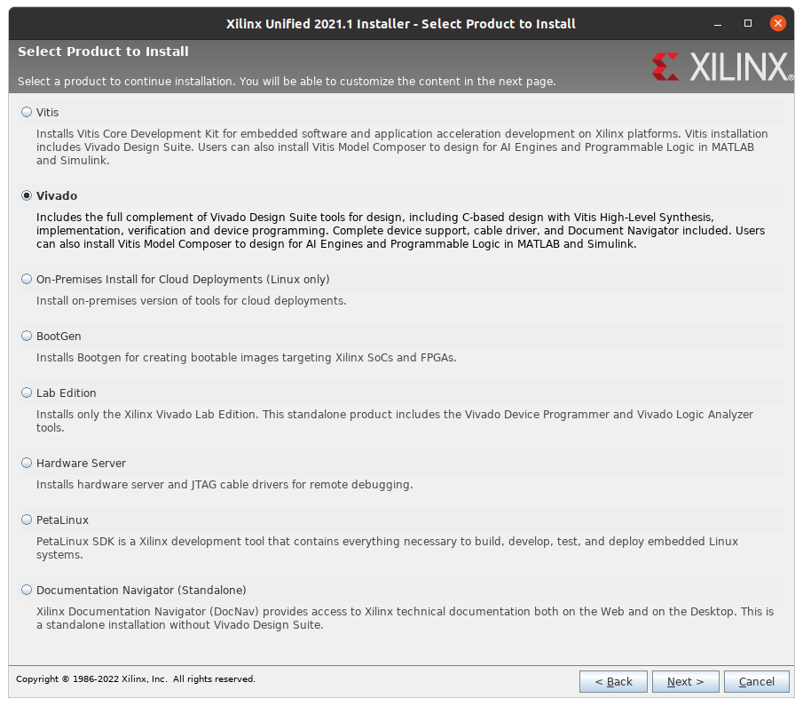
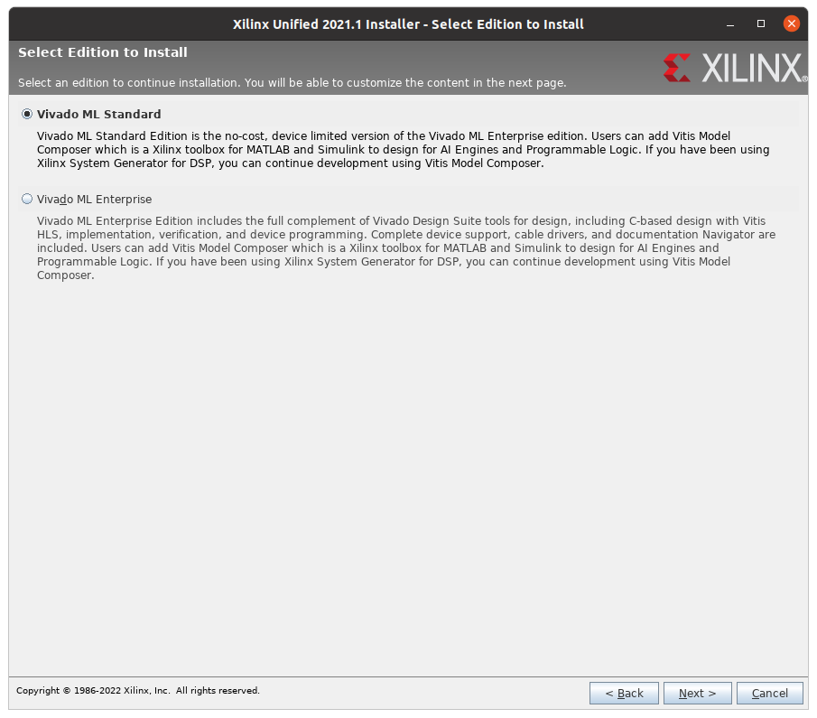
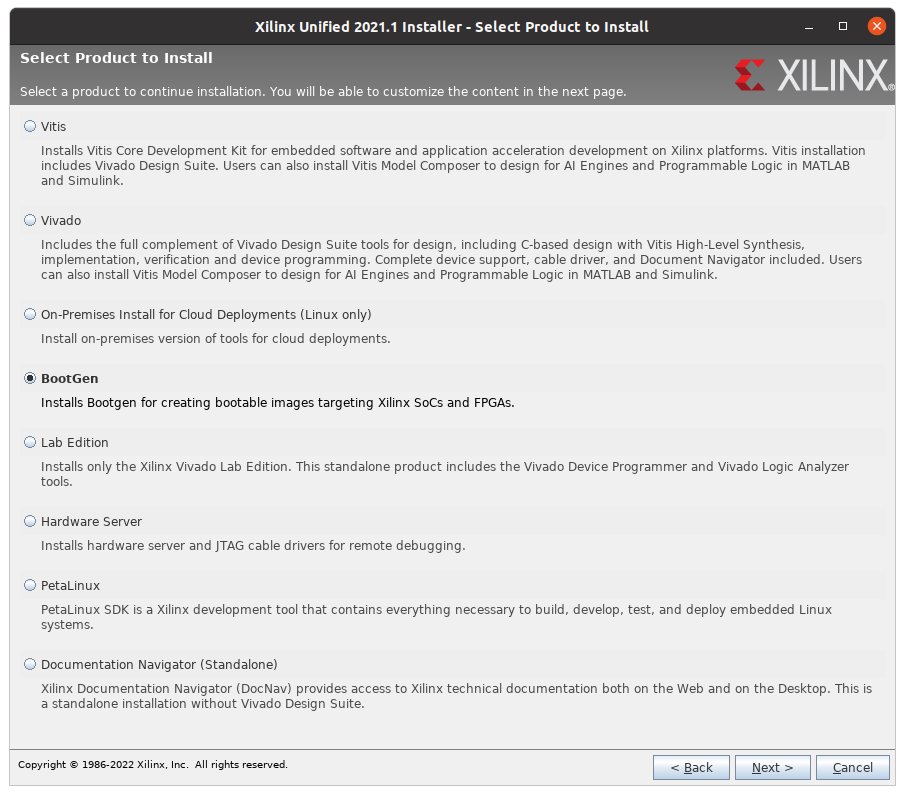

## Install Vivado HL WebPack 2021.1

### Known issue

Vivado stuck at "Generating installed device list" due to a missing package:

```
sudo apt install libtinfo5
```

### GUI way

Download [Vivado 2021.1](https://www.xilinx.com/member/forms/download/xef.html?filename=Xilinx_Unified_2021.1_0610_2318_Lin64.bin)

You need to create a Xilinx account to download Vivado.

#### Install *Vivado HL WebPack* and *Bootgen*.

```
chmod +x Xilinx_Unified_2021.1_0610_2318_Lin64.bin
sudo ./Xilinx_Unified_2021.1_0610_2318_Lin64.bin
```







### CLI way

Xilinx batch mode could take several minutes before prompt.

```
chmod +x Xilinx_Unified_2021.1_0610_2318_Lin64.bin
sudo ./Xilinx_Unified_2021.1_0610_2318_Lin64.bin -- -b AuthTokenGen
```

Complete with your Xilinx ID/password

#### Install Vivado WebPack

```
sudo ./Xilinx_Unified_2021.1_0610_2318_Lin64.bin -- -b ConfigGen
```

Select Vivado and Vivado WebPack edition and 

Check the installation path and unselect the unwanted Modules by changing the `:1` into `:0` in the `Modules` section of `install_config.txt`.

Install it.

```
sudo ./Xilinx_Unified_2021.1_0610_2318_Lin64.bin -- -a 3rdPartyEULA,WebTalkTerms,XilinxEULA -b Install -c /root/.Xilinx/install_config.txt
```

#### Install BootGen

```
sudo ./Xilinx_Unified_2021.1_0610_2318_Lin64.bin -- -b ConfigGen
```

Select BootGen and install it.

```
sudo ./Xilinx_Unified_2021.1_0610_2318_Lin64.bin -- -a 3rdPartyEULA,WebTalkTerms,XilinxEULA -b Install -c /root/.Xilinx/install_config.txt
```

## Set-up Vivado

Source your fresh Vivado install

```
source /tools/Xilinx/Vivado/2021.1/settings64.sh
```

Check the installation with:
```
vivado -version
bootgen
```
